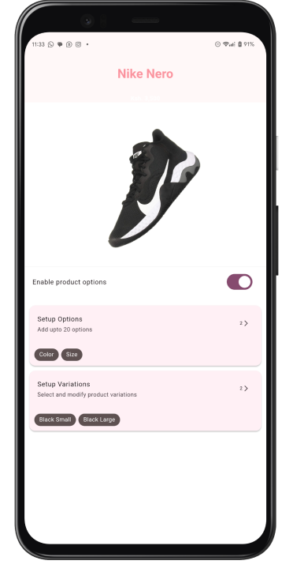
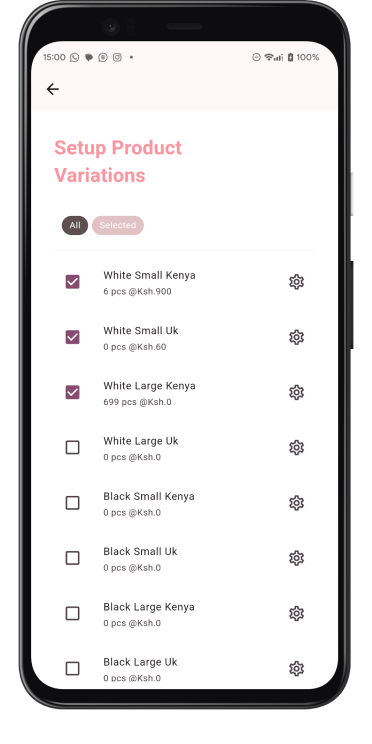

# Product Options
## _Shopify like way to add product options & variations_
#
 
### Download APK: 
- [app-arm64-v8a-release.apk](apk/app-arm64-v8a-release.apk)
- [app-armeabi-v7a-release.apk](apk/app-armeabi-v7a-release.apk)
- [app-x86_64-release.apk](apk/app-x86_64-release.apk)

#


 

Flutter based project on how users can add E-commerce product options and variants UI/ UX as in [Shopify](https://admin.shopify.com/)


## Higlighted features 

- Auto generating product variations
- Selecting variations
- Modifying product variation details like `price` & `quantity`
- Adding product options
- Editing a product option


## _Challenges encountered_
During the creation of this software, here are some of the callenges i encountered and how i tackled them.

| Challenge | Description| Solution |
| ------ | ------ |---|
|Ux Design| Since the example shown on [this video](https://www.youtube.com/watch?v=njdHCpildhE) / live expeience on  [Shopify](https://admin.shopify.com/) is based o a desktop view, adapting the same view on mobile was a challenge due to size constraints|Design a multi screen interface for different actions |
|State management| Passing data to screens/Widgets was prone to errors and redundant | Implementing state management with the use of `Provider` and `ChangeNotifier` |
|Generating product variations | Product variations are a unique combination of product options such as color and size. e.g `Large Black`, `Large white`, `Small Black`, `Small white`. It was neccessary that these combinations were generated every time that product options were updated without redundance such as having `Small Black` and `Black Small` since thats the same thing. A regular nested for loop would have therefore not worked in this case|We create a recursive function to generate combinations of the variations dynamically|


## Installation

This will work on Android devices.
Download the apk from the link above and install on your device to use.

## Development

Want to contribute? Great!

Make sure you have flutter installed on your device. Follow the specific instructions to install flutter from their  [Official](https://flutter.dev/) website.


Clone the repository

```sh
git clone https://github.com/Brightmuk/product-options
```

In terminal /cmd change directory to the project directory

```sh
cd product-options
```

Connect your devices or launch an emulator then run project

```sh
flutter run
```


## License

MIT

**Free Software**

[//]: # (These are reference links used in the body of this note and get stripped out when the markdown processor does its job. There is no need to format nicely because it shouldn't be seen. Thanks SO - http://stackoverflow.com/questions/4823468/store-comments-in-markdown-syntax)

   [dill]: <https://github.com/joemccann/dillinger>
   [git-repo-url]: <https://github.com/joemccann/dillinger.git>
   [john gruber]: <http://daringfireball.net>
   [df1]: <http://daringfireball.net/projects/markdown/>
   [markdown-it]: <https://github.com/markdown-it/markdown-it>
   [Ace Editor]: <http://ace.ajax.org>
   [node.js]: <http://nodejs.org>
   [Twitter Bootstrap]: <http://twitter.github.com/bootstrap/>
   [jQuery]: <http://jquery.com>
   [@tjholowaychuk]: <http://twitter.com/tjholowaychuk>
   [express]: <http://expressjs.com>
   [AngularJS]: <http://angularjs.org>
   [Gulp]: <http://gulpjs.com>

   [PlDb]: <https://github.com/joemccann/dillinger/tree/master/plugins/dropbox/README.md>
   [PlGh]: <https://github.com/joemccann/dillinger/tree/master/plugins/github/README.md>
   [PlGd]: <https://github.com/joemccann/dillinger/tree/master/plugins/googledrive/README.md>
   [PlOd]: <https://github.com/joemccann/dillinger/tree/master/plugins/onedrive/README.md>
   [PlMe]: <https://github.com/joemccann/dillinger/tree/master/plugins/medium/README.md>
   [PlGa]: <https://github.com/RahulHP/dillinger/blob/master/plugins/googleanalytics/README.md>
